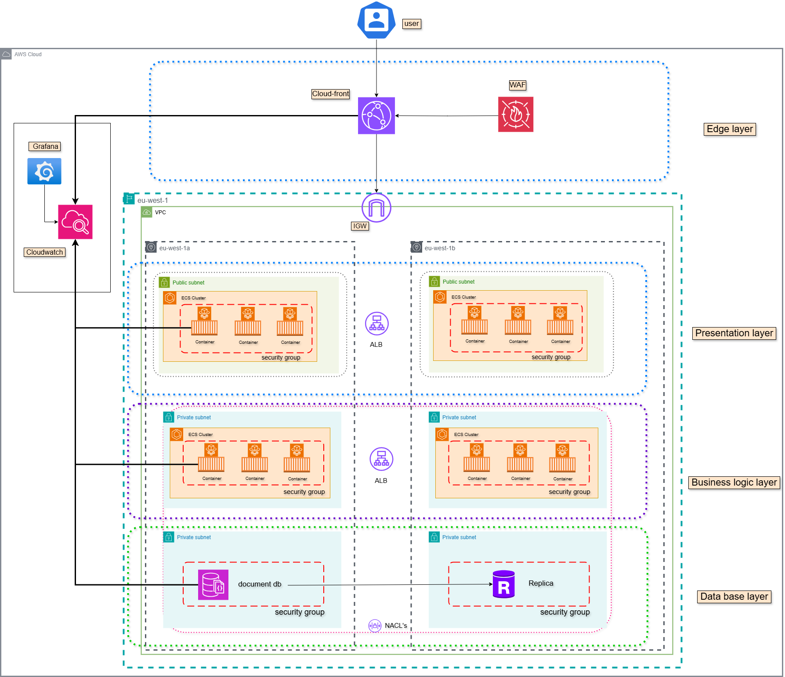

# 🌐 Multi-Tier Web Application with Serverless Architecture Using IaC (Terraform)

This repository delivers a complete **Infrastructure as Code (IaC)** implementation to provision and manage a **multi-tier serverless application on AWS**, using **modular Terraform**, **CloudWatch monitoring**, **Docker containers**, and **CI/CD automation**. The architecture follows cloud-native best practices for scalability, security, observability, and high availability.

---

## 📐 Architecture Overview

The system is structured into **4 logical layers** for clear separation of concerns and scalability:

### 🔹 1. Edge Layer
- **Amazon CloudFront**: Caches and distributes static content globally
- **AWS WAF**: Protects against common web-based attacks (SQLi, XSS, etc.)

### 🔹 2. Presentation Layer
- **ECS Fargate in Public Subnets**: Hosts frontend Docker containers
- **Application Load Balancer (ALB)**: Manages routing and scaling of UI components

### 🔹 3. Business Logic Layer
- **ECS Fargate in Private Subnets**: Hosts backend Docker containers (APIs)
- **Internal ALB**: Used for secure communication between services

### 🔹 4. Database Layer
- **Amazon DocumentDB**: MongoDB-compatible, deployed in isolated private subnets
- **NACLs + Security Groups**: Enforce strict access control to DB layer

### 📊 Monitoring & Telemetry
- **AWS CloudWatch**: Logs, metrics, dashboards, and alarms
- **Prometheus + Grafana Stack**: Self-hosted on EC2 for custom metric ingestion

> 🔍 See [architecture/README.md](./architecture/README.md) for a deeper breakdown  
> 🖼 View the architecture diagram here: `architecture/Serverless.png`

---

## 📁 Repository Structure

```bash
.
├── architecture/                  # Diagram + documentation of AWS setup
│   ├── Serverless.png
│   └── README.md
├── modules/                       # Modular Terraform components
│   ├── edge_layer/                # CloudFront + WAF
│   ├── ecs-frontend/              # Frontend containers + Dockerfile
│   ├── ecs-backend/               # Backend services + Dockerfile
│   ├── database/                  # DocumentDB cluster
│   ├── monitoring/                # Prometheus & Grafana + CloudWatch
│   ├── IAMRoles/                  # IAM role management
│   ├── network/                   # VPC, subnets, NAT, IGW
│   └── security-groups/           # Security group definitions
├── global_main.tf                 # Composed root module
├── global_outputs.tf              # Outputs exposed from root
├── global_variables.tf            # Variables used across modules
├── terraform.tfvars               # Variables with actual values
├── provider.tf                    # AWS provider declaration
├── commands.sh                    # Custom command runner (bash)
├── README.md                      # Main README (you are here)
└── terraform.tfstate              # Terraform state (DO NOT EDIT)
````

---

## 🚀 How to Deploy

### 🔧 Prerequisites

Ensure your system meets the following requirements:

#### ✅ System Tools

* **AWS CLI**: To interact with AWS services
* **Terraform v1.3+**: For IaC deployments
* **Docker Engine**: For building frontend and backend images
* **Git**: To clone and version-control this repository
* **bash**, **curl**, **wget**

#### ✅ AWS Requirements

Ensure your IAM user or assumed role has access to provision the following:

* Amazon ECS (Fargate)
* EC2 (for monitoring instances)
* VPC, Subnets, NAT, IGW
* CloudFront, WAF
* DocumentDB
* CloudWatch (logs + metrics)
* IAM Role creation
* Security Groups, NACLs

#### ✅ Docker Containers Used

| Module         | Container Used                | Purpose                            |
| -------------- | ----------------------------- | ---------------------------------- |
| `ecs-frontend` | Custom Dockerfile (React/Vue) | Hosts frontend UI                  |
| `ecs-backend`  | Custom Dockerfile (Node/Java) | Hosts backend APIs                 |

---

### 1. Set AWS Credentials

```bash
export AWS_ACCESS_KEY_ID=your_access_key
export AWS_SECRET_ACCESS_KEY=your_secret_key
export AWS_REGION=eu-west-1
```

---

### 2. Initialize Terraform

```bash
terraform init
```

---

### 3. Format Code (Recommended)

```bash
terraform fmt -recursive
```

---

### 4. Deploy Infrastructure

```bash
terraform apply --auto-approve
```

---

### 5. Tear Down Infrastructure

```bash
terraform destroy --auto-approve
```

---

## 📈 Observability & Monitoring

This project integrates both native AWS monitoring and self-hosted tools:

* **CloudWatch Dashboards**: Logs, ECS metrics, alarms
* **Prometheus**: Collects metrics using custom rules (`prometheus.yml`)
* **Grafana**: Dashboards for ECS, EC2, and application health

> Setup scripts for Prometheus and Grafana are located in:

```bash
modules/monitoring/install-Prometheus-and-Grafana-Server.sh
```

---

## 📑 Useful Commands

### 🔍 Check EC2 Cloud-Init Logs

```bash
sudo cat /var/log/cloud-init-output.log
```

### 🛠️ Terraform Automation Shortcuts

```bash
terraform apply --auto-approve
terraform destroy --auto-approve
terraform fmt -recursive
```

---

## 📸 Architecture Diagram



---

## 🧑‍💻 Author

**Moamen Ahmed**
📧 Email: [moamen800@gmail.com](mailto:moamen800@gmail.com)
