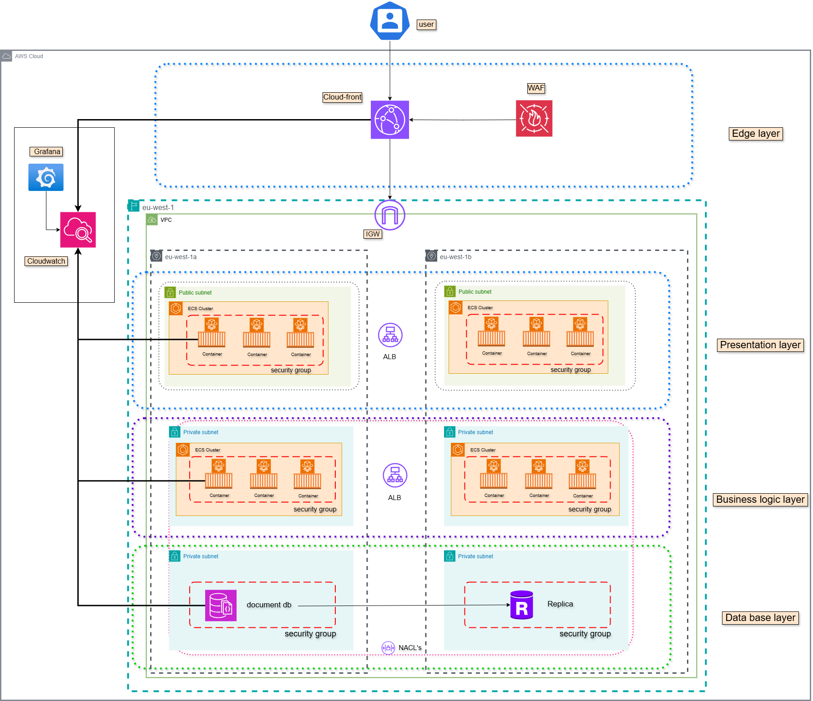

# Architecture Overview

This folder contains the high-level architecture diagram for the multi-tier serverless application.

### Layers:
- **Edge Layer**: CloudFront, WAF
- **Presentation Layer**: ECS (public subnet)
- **Business Logic Layer**: ECS (private subnet)
- **Database Layer**: DocumentDB and Replica

### Monitoring:
- Integrated with **CloudWatch** and **Grafana**
